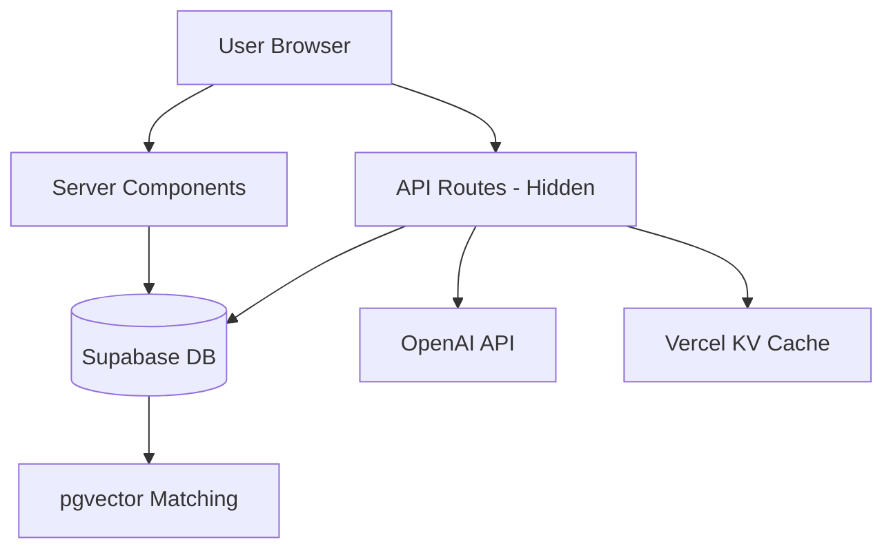

# System Architecture - HelloEveryone.fun

## Security & Code Visibility

### Server-Side (HIDDEN from users)

- `/app/api/*` routes - All matching logic here
- Database functions - Complex queries in PostgreSQL
- Server Components - Data fetching, no `'use client'`
- Environment variables (without `NEXT_PUBLIC_` prefix)

### Client-Side (Visible to users)

- UI components with `'use client'` directive
- Basic form validation
- UI state management

## Core Architecture Principles

1. **Monolithic Next.js** - Single codebase, API routes as backend
2. **Database-Driven Logic** - Matching algorithms in PostgreSQL functions
3. **Progressive Disclosure** - Show only what users need to see
4. **Edge-First** - Deploy to Vercel Edge Network
5. **Privacy by Design** - Mutual visibility enforced in database

## Tech Stack Details

### Backend (Server-Side TypeScript)

```typescript
// app/api/match/route.ts - THIS IS HIDDEN FROM USERS
export async function POST(request: Request) {
  // Secret matching algorithm here
  // OpenAI API calls here
  // Database queries here
  // Users CANNOT see this code
}
```

### Database Layer

```sql
-- Supabase PostgreSQL functions - COMPLETELY HIDDEN
CREATE OR REPLACE FUNCTION calculate_match_score(user1_id UUID, user2_id UUID)
RETURNS FLOAT AS $$
  -- Complex matching logic here
  -- Users cannot access this
$$ LANGUAGE plpgsql SECURITY DEFINER;
```

### Frontend (Client-Side React)

```typescript
// components/MatchCard.tsx - Users CAN see this
'use client' // This directive makes it client-side
export function MatchCard({ matchPercentage }) {
  // Only UI logic here, no secrets
}
```

## Directory Structure

**Current Project Structure:**

```
helloeveryone/
├── app/                       # Next.js App Router
│   ├── (public)/             # Public routes - no auth required
│   │   ├── page.tsx          # Landing page (Server Component)
│   │   ├── login/page.tsx    # Login page
│   │   ├── signup/page.tsx   # Signup page
│   │   └── auth/reset-password/page.tsx
│   ├── (protected)/          # Protected routes - auth required
│   │   ├── admin/           # Admin panel (role-based access)
│   │   │   ├── page.tsx     # Admin dashboard
│   │   │   ├── analytics/   # Analytics page
│   │   │   ├── events/      # Event management
│   │   │   └── users/       # User management
│   │   ├── chat/            # Messaging system
│   │   │   ├── page.tsx     # Chat overview
│   │   │   └── [userId]/    # Individual conversations
│   │   ├── dashboard/page.tsx # Main user dashboard
│   │   ├── events/          # Event browsing
│   │   │   ├── page.tsx     # Event list
│   │   │   ├── past/        # Past events
│   │   │   └── [id]/        # Event details
│   │   ├── favorites/page.tsx # Favorited users
│   │   └── matches/         # Match results
│   │       ├── page.tsx     # Match list
│   │       └── [userId]/    # Individual match details
│   ├── api/                 # Server-side API (HIDDEN FROM USERS)
│   │   ├── calendar/        # ICS file generation
│   │   ├── chat/           # Messaging endpoints
│   │   ├── events/         # Event management
│   │   ├── health/         # Health checks
│   │   ├── match/          # Matching engine
│   │   ├── privacy/        # Privacy controls
│   │   └── profile/        # Profile operations
│   ├── auth/callback/       # OAuth callback handler
│   ├── contexts/           # React contexts
│   │   └── AuthContext.tsx # Client-side auth state
│   ├── globals.css         # Global styles
│   └── layout.tsx          # Root layout
├── components/             # Reusable React components
│   ├── admin/             # Admin panel components
│   ├── calendar/          # Calendar integration
│   ├── chat/              # Chat/messaging components
│   ├── events/            # Event-related components
│   ├── landing/           # Landing page components
│   ├── matches/           # Match display components
│   ├── matching/          # Matching UI components
│   ├── navigation/        # Navigation components
│   ├── profile/           # Profile components
│   ├── ui/                # Basic UI components (shadcn/ui)
│   ├── PWAInstallPrompt.tsx
│   └── PWAUpdatePrompt.tsx
├── hooks/                 # Custom React hooks
│   ├── useCalendar.ts
│   ├── useEventMatches.ts
│   ├── useFavorites.ts
│   ├── useIsMobile.ts
│   ├── useMatching.ts
│   └── useRSVP.ts
├── lib/                   # Business logic and utilities
│   ├── api/              # Server-side API helpers (HIDDEN)
│   │   ├── admin.ts      # Admin operations
│   │   ├── auth.ts       # Authentication helpers
│   │   ├── blocking.ts   # User blocking logic
│   │   ├── chat.ts       # Chat/messaging logic
│   │   ├── errors.ts     # Error handling
│   │   ├── favorites.ts  # Favorites management
│   │   ├── matching.ts   # Matching algorithms
│   │   ├── messages.ts   # Message handling
│   │   ├── privacy.ts    # Privacy controls
│   │   ├── profiles.ts   # Profile operations
│   │   ├── rate-limit.ts # Rate limiting
│   │   ├── responses.ts  # API response helpers
│   │   ├── rsvp.ts       # RSVP logic
│   │   └── search.ts     # Search functionality
│   ├── calendar/         # Calendar/ICS utilities
│   ├── matching/         # Matching algorithms (SERVER ONLY)
│   ├── privacy/          # Privacy utilities
│   ├── supabase/         # Database layer
│   │   ├── client.ts     # Browser client
│   │   ├── server.ts     # Server client (hidden)
│   │   └── queries.ts    # Database queries (hidden)
│   ├── utils/           # General utilities
│   └── validations/     # Zod validation schemas
├── types/               # TypeScript type definitions
│   ├── database.ts      # Generated Supabase types
│   ├── event.ts         # Event types
│   ├── index.ts         # Main type exports
│   ├── profile.ts       # Profile types
│   └── supabase.ts      # Extended Supabase types
├── public/              # Static assets
│   └── manifest.json    # PWA manifest
└── middleware.ts        # Edge middleware (HIDDEN)
```

## Data Flow Architecture



## Matching Algorithm Location

### Where Matching Logic Lives (ALL HIDDEN):

1. **Database Functions** (PostgreSQL)
   - Main matching calculations
   - Privacy rules enforcement
   - Score caching

2. **API Routes** (`/app/api/match/*`)
   - OpenAI embedding generation
   - Match orchestration
   - Result formatting

3. **Edge Functions** (Optional)
   - Real-time match updates
   - Notification triggers

## Environment Variables

```bash
# .env.local (SERVER ONLY - Hidden)
SUPABASE_SERVICE_KEY=xxx        # Admin access
OPENAI_API_KEY=xxx              # For embeddings
MATCH_ALGORITHM_VERSION=v1      # Algorithm config

# .env.local (CLIENT ACCESSIBLE)
NEXT_PUBLIC_SUPABASE_URL=xxx    # Public URL
NEXT_PUBLIC_SUPABASE_ANON=xxx   # Public anon key
```

## API Route Structure

```typescript
// app/api/match/calculate/route.ts
// THIS ENTIRE FILE IS HIDDEN FROM USERS

import { createClient } from '@/lib/supabase/server'
import { generateEmbedding } from '@/lib/openai/server'

export async function POST(request: Request) {
  // 1. Authenticate user
  const supabase = createClient()
  const {
    data: { user },
  } = await supabase.auth.getUser()

  // 2. Get user profile and preferences
  // 3. Generate embeddings (server-side only)
  // 4. Call PostgreSQL matching function
  // 5. Return sanitized results

  return Response.json({
    matches: sanitizedMatches, // Only safe data
  })
}
```

## Database Security Model

```sql
-- Row Level Security ensures mutual visibility
CREATE POLICY "mutual_visibility" ON profiles
  FOR SELECT USING (
    -- Complex logic here, users can't bypass
    check_mutual_visibility(auth.uid(), id)
  );

-- Matching function (runs server-side only)
CREATE FUNCTION calculate_match_score(
  user1_id UUID,
  user2_id UUID
) RETURNS TABLE (
  score FLOAT,
  reasons JSONB
) SECURITY DEFINER -- Runs with elevated privileges
AS $$
BEGIN
  -- Proprietary matching algorithm here
  -- Completely hidden from users
END;
$$ LANGUAGE plpgsql;
```

## Client-Server Boundary

### Server Components (Default - Hidden Logic)

```typescript
// app/events/[id]/page.tsx
async function EventPage({ params }) {
  // This runs on server, hidden from users
  const matches = await calculateMatches(params.id)

  return <EventDetail matches={matches} />
}
```

### Client Components (Visible - UI Only)

```typescript
// components/features/MatchCard.tsx
'use client' // Makes this client-side

export function MatchCard({ match }) {
  // Only UI logic here
  // No sensitive algorithms
  return <div>{match.score}% Match</div>
}
```

## Performance Architecture

### Caching Strategy

1. **Match Scores**: PostgreSQL materialized view (1hr refresh)
2. **Embeddings**: Cached in database permanently
3. **API Responses**: Vercel Edge Cache (5 min)
4. **Static Pages**: ISR (Incremental Static Regeneration)

### Database Indexes

```sql
-- Critical indexes for performance
CREATE INDEX idx_profiles_embedding ON profiles
  USING ivfflat (bio_embedding vector_cosine_ops);
CREATE INDEX idx_events_date ON events(event_date);
CREATE INDEX idx_match_scores ON match_scores(user1_id, user2_id);
```

## PWA Architecture

### Service Worker Strategy

- Cache-first for assets
- Network-first for API calls
- Background sync for messages
- Push notifications for event reminders

### Offline Capabilities

- Browse cached events
- View saved matches
- Queue messages for sending
- Download calendar files offline
