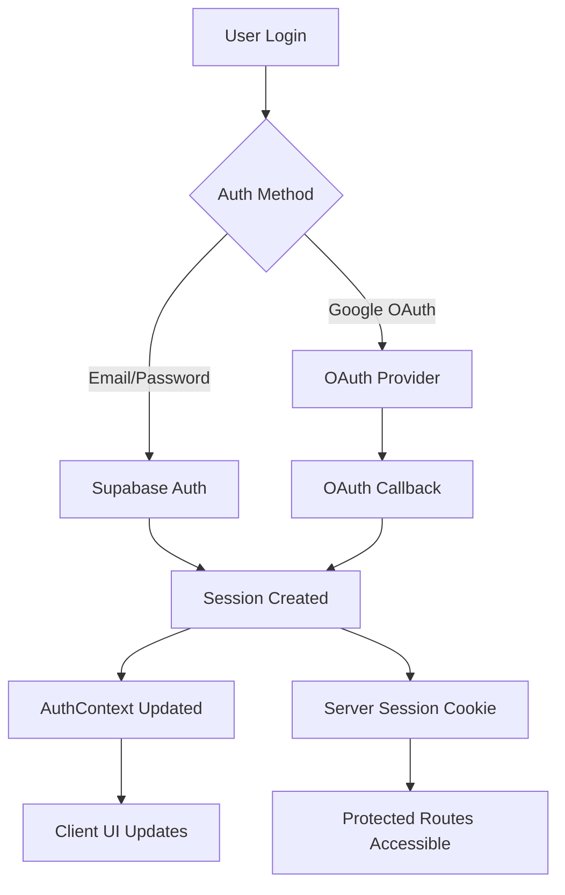

# Authentication System Documentation

## Overview

HelloEveryone uses Supabase Auth for authentication with both server-side and client-side components. The system supports email/password authentication and Google OAuth.

## Authentication Architecture

### Dual Auth System

The app uses a dual authentication approach:

1. **Server-Side Auth** (`lib/api/auth.ts`) - For API routes and server components
2. **Client-Side Auth** (`app/contexts/AuthContext.tsx`) - For client components and UI state

### Authentication Flow



## Server-Side Authentication

**Location:** `lib/api/auth.ts`

### Core Functions

```typescript
// For page components - redirects to login if not authenticated
export async function requireAuth(): Promise<User>

// For API routes - throws error if not authenticated  
export async function requireAuthAPI(): Promise<User>

// For optional auth - returns user or null
export async function getCurrentUser(): Promise<User | null>

// Create server-side Supabase client
export async function createSupabaseServerClient()
```

### Usage in API Routes

```typescript
// app/api/match/calculate/route.ts
export async function POST(request: Request) {
  const user = await requireAuthAPI() // Throws if not authenticated
  
  // Protected API logic here
  return Response.json({ data: 'protected' })
}
```

### Usage in Server Components

```typescript
// app/(protected)/dashboard/page.tsx
export default async function DashboardPage() {
  const user = await requireAuth() // Redirects if not authenticated
  
  // Server component logic here
  return <div>Welcome {user.email}</div>
}
```

## Client-Side Authentication

**Location:** `app/contexts/AuthContext.tsx`

### AuthContext Provider

Wraps the entire application and provides authentication state to all client components.

```typescript
interface AuthContextType {
  user: User | null
  loading: boolean
  signIn: (email: string, password: string) => Promise<{ user: User } | { error: AuthError }>
  signUp: (email: string, password: string, userData: SignUpData) => Promise<{ user: User } | { error: AuthError }>
  signOut: () => Promise<{ error: AuthError | null }>
  resetPassword: (email: string) => Promise<{ error: AuthError | null }>
}
```

### Usage in Client Components

```typescript
'use client'
import { useAuth } from '@/app/contexts/AuthContext'

export function ClientComponent() {
  const { user, signIn, signOut, loading } = useAuth()
  
  if (loading) return <div>Loading...</div>
  if (!user) return <div>Please login</div>
  
  return <div>Welcome {user.email}</div>
}
```

## Authentication Routes

### Public Routes

- `/login` - User login page
- `/signup` - User registration page  
- `/auth/reset-password` - Password reset page
- `/` - Landing page (accessible to all)

### Protected Routes

All routes under `(protected)/` require authentication:

- `/dashboard` - Main user dashboard
- `/events` - Event browsing
- `/matches` - Match results
- `/chat` - Messaging
- `/favorites` - Favorited users
- `/admin` - Admin panel (role-based)

### OAuth Callback

- `/auth/callback` - Handles OAuth redirects from Google

## Route Protection

### Middleware Protection

**Location:** `middleware.ts`

```typescript
export async function middleware(request: NextRequest) {
  // Check authentication for protected routes
  if (request.nextUrl.pathname.startsWith('/(protected)')) {
    const supabase = createServerClient()
    const { data: { session } } = await supabase.auth.getSession()
    
    if (!session) {
      return NextResponse.redirect(new URL('/login', request.url))
    }
  }
}
```

### Component-Level Protection

Use `ProtectedRoute` component for client-side route protection:

```typescript
import { ProtectedRoute } from '@/components/ProtectedRoute'

export default function ProtectedPage() {
  return (
    <ProtectedRoute>
      <div>This content requires authentication</div>
    </ProtectedRoute>
  )
}
```

## User Registration Flow

### 1. Sign Up Form
- User provides email, password, and profile data
- Form validation using Zod schemas
- Password requirements enforced

### 2. Account Creation
```typescript
const { user, error } = await signUp(email, password, {
  first_name,
  last_name,
  age,
  interests: [],
  bio: ''
})
```

### 3. Profile Creation
- Automatic profile record creation via database triggers
- Default privacy settings applied
- Welcome email sent (optional)

## Password Reset Flow

### 1. Request Reset
```typescript
const { error } = await resetPassword(email)
```

### 2. Email Verification
- User receives reset email from Supabase
- Email contains secure reset link

### 3. Password Update
- User clicks link and updates password
- Automatic redirect to dashboard

## Google OAuth Integration

### Setup Requirements

Environment variables needed:
```env
NEXT_PUBLIC_SUPABASE_URL=your-supabase-url
NEXT_PUBLIC_SUPABASE_ANON_KEY=your-supabase-anon-key
```

Supabase configuration:
- Google OAuth provider enabled
- Redirect URLs configured
- Client ID and secret set

### OAuth Flow

1. User clicks "Sign in with Google"
2. Redirected to Google OAuth
3. User authorizes application
4. Google redirects to `/auth/callback`
5. Callback handler processes OAuth response
6. User session created and redirected to dashboard

## Session Management

### Session Storage
- Server-side: HTTP-only cookies
- Client-side: Memory + localStorage backup
- Automatic refresh handling

### Session Security
- CSRF protection via SameSite cookies
- Secure flag in production
- Automatic expiration handling

### Session Persistence
- Sessions persist across browser restarts
- Automatic refresh before expiration
- Graceful handling of expired sessions

## Role-Based Access Control

### User Roles

Currently supported roles:
- `user` - Standard user (default)
- `admin` - Administrative access

### Role Checking

Server-side:
```typescript
export async function requireAdmin(): Promise<User> {
  const user = await requireAuthAPI()
  
  if (user.user_metadata?.role !== 'admin') {
    throw new Error('Admin access required')
  }
  
  return user
}
```

Client-side:
```typescript
const { user } = useAuth()
const isAdmin = user?.user_metadata?.role === 'admin'
```

## Security Best Practices

### Password Requirements
- Minimum 8 characters
- At least one uppercase letter
- At least one number
- No common passwords

### Rate Limiting
- Login attempts: 5 per minute per IP
- Password reset: 3 per hour per email
- Sign up: 10 per hour per IP

### Session Security
- Automatic logout after 24 hours of inactivity
- Concurrent session limits
- Device tracking and management

### Data Protection
- All authentication data encrypted at rest
- Secure transmission via HTTPS
- No sensitive data in client storage

## Troubleshooting

### Common Issues

1. **"Unauthorized" errors**
   - Check if user session is valid
   - Verify API route authentication
   - Confirm middleware configuration

2. **OAuth callback failures**
   - Verify redirect URLs in Supabase
   - Check environment variables
   - Validate OAuth provider setup

3. **Session persistence issues**
   - Clear browser storage
   - Check cookie settings
   - Verify CORS configuration

### Debug Tools

- Enable Supabase debug logging
- Check browser network tab
- Review server logs for auth errors
- Use Supabase dashboard for user management

## Environment Configuration

### Development
```env
NEXT_PUBLIC_SUPABASE_URL=http://localhost:54321
NEXT_PUBLIC_SUPABASE_ANON_KEY=your-local-key
```

### Production
```env
NEXT_PUBLIC_SUPABASE_URL=https://your-project.supabase.co
NEXT_PUBLIC_SUPABASE_ANON_KEY=your-production-key
```

### Testing
- Use Supabase local development setup
- Mock authentication for unit tests
- E2E tests with test user accounts